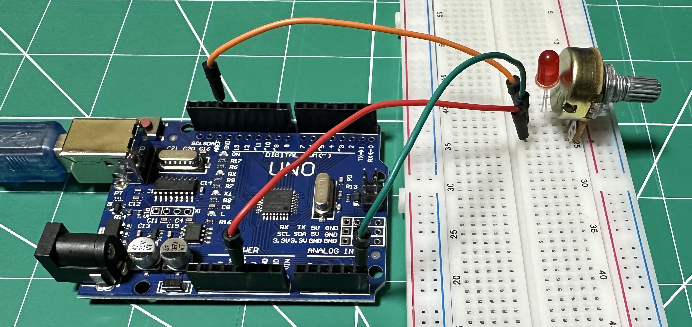

# Dimmable-LED-with-Potentiometer
This Arduino project reads an analog value from pin A5 and converts it into a voltage value between 0 and 5 volts. The voltage is then printed to the serial monitor every 500 milliseconds.

## Hardware Setup



## Hardware Requirements

- Arduino board (e.g., Uno, Mega)
- Potentiometer connected to pin A5
- LED
- Resistor (appropriate value to limit current to the LED)
- USB cable for connecting the Arduino to a computer

## Software Requirements

- Arduino IDE

## How it Works

1. The `analogRead()` function reads the voltage value from the analog pin A5. 
2. The value is scaled from a 10-bit (0-1023) range to a voltage range (0-5V) using the formula:

   ```
   Voltage = (5.0 / 1023.0) * analogRead(ReadPin)
   ```

3. The calculated voltage is sent to the serial monitor for display.
4. The reading is repeated every 500 milliseconds.

## **Warning**

When using a potentiometer in this setup, **do not reduce the resistance too much**, as this could cause too much current to flow through the LED, potentially **burning it out**. Always ensure a proper current-limiting resistor is used in series with the LED to protect it.

## Usage

1. Upload the code to your Arduino board using the Arduino IDE.
2. Open the serial monitor to view the real-time voltage readings from pin A5.

## License

This project is open-source and available for personal or educational use.

